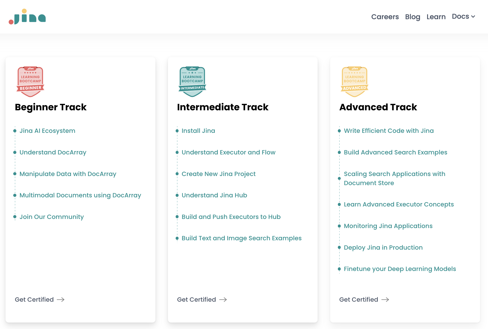

# Jina AI

Jina AI 是一家专注于 AI 和多模态通用搜索技术的开源软件公司。

通过使用完全开源的 Jina 全家桶，开发者和企业可以轻松打造多模态/跨模态应用。从原型设计到方案实施，再到系统的云上部署和监视，以及搜索结果的调优，Jina 全家桶为你准备了全链路的解决方案。

开发者如何使用

- 从 **[DocArray](https://github.com/jina-ai/docarray)** 开始设计原型

- **[Jina](https://github.com/jina-ai/jina)** 将它变成服务

- 你可以参考 **[Jina Hub](https://github.com/jina-ai/Jina-hub)** 里的组件，加速开发进度

- 接着，你可以使用 [**JCloud**](https://github.com/jina-ai/JCloud) 部署项目

- 如果对准确率、召回率不满意，可以使用 [**Finetuner**](https://github.com/jina-ai/finetuner) 对模型调优

- 如果你处理的数据是文本和图像，可以使用 **[CLIP as service](https://github.com/jina-ai/clip-as-service)** 作为向量服务

## 任务挑战

1. (赢得贴纸+口罩) 完成 [**Developer Portal**](*https://learn.jina.ai/*) 的初级挑战

2. (赢得笔记本) 使用 **[DiscoArt](*https://github.com/jina-ai/discoart*)** 完成 AI 艺术创作

   

   

3. (赢得托特包) 用 **[Jina NOW](*https://github.com/jina-ai/now*)** 搭建一个跨模态搜索应用

## 联系我们

- 加入全球社区：https://slack.jina.ai/

- 加入中文社区：关注公众号 Jina AI，或添加小助手微信 Jinaai01

- Github Repo ：https://github.com/jina-ai

- 官方网站：[Jina.ai](https://jina.ai/)

